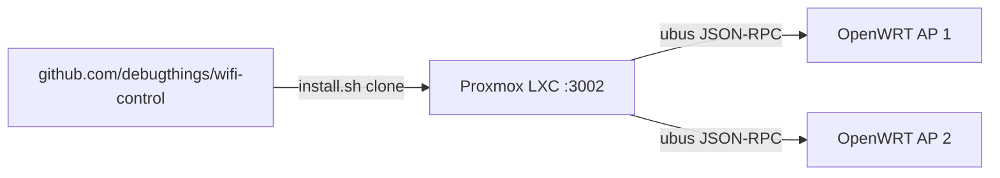

<!-- 2064d804-8993-44cc-a80a-397a892e0345 -->
---
todos:
  - id: "deploy-lxc"
    content: "Deploy wifi-control to Proxmox LXC via install.sh and verify systemd service on :3002"
    status: pending
  - id: "bootstrap-aps"
    content: "Run bootstrap-ap.sh on each OpenWRT AP and save wifi-control rpcd passwords"
    status: pending
  - id: "configure-ui"
    content: "Set PIN, register APs, discover SSIDs, and add network mappings in admin UI"
    status: pending
  - id: "optional-https"
    content: "Optional: add NGINX reverse proxy with HTTPS on debugthings.com subdomain"
    status: pending
isProject: false
---
# Deploy WiFi Control (Post-Repo)

## Current state

Git is fully set up — no further push needed:

- Remote: `https://github.com/debugthings/wifi-control.git`
- Branch: `main` (tracking `origin/main`, up to date)
- Commit: `5801504` — initial app commit
- [`install.sh`](file:///home/debugthings/repos/wifi-control/install.sh) and [`deploy.sh`](file:///home/debugthings/repos/wifi-control/deploy.sh) already clone from this GitHub URL



## Step 1: Deploy to Proxmox LXC

Create a Debian 12 LXC (same pattern as timer-app), then inside the container:

```bash
git clone https://github.com/debugthings/wifi-control.git /tmp/wifi-control
cd /tmp/wifi-control
bash install.sh
```

What `install.sh` does:
- Installs Node 20, clones/builds the app to `/opt/wifi-control`
- Generates `ENCRYPTION_KEY` in `/opt/wifi-control/.env`
- Runs Prisma migrations against `/opt/wifi-control/data/wifi-control.db`
- Installs and starts `wifi-control.service` on port **3002**

Verify:
```bash
systemctl status wifi-control
curl http://localhost:3002/api/auth/settings
```

## Step 2: Bootstrap each OpenWRT AP

Copy [`openwrt/`](file:///home/debugthings/repos/wifi-control/openwrt/) to each AP (scp from LXC or laptop), then on the AP as root:

```bash
cd openwrt/scripts
chmod +x bootstrap-ap.sh wifi-iface-toggle.sh
./bootstrap-ap.sh
```

This installs:
- `uhttpd-mod-ubus`, `rpcd-mod-uci`, `rpcd-mod-file`
- Scoped ACL at `/usr/share/rpcd/acl.d/wifi-control.json`
- rpcd user `wifi-control` with a generated password
- Toggle script at `/usr/local/bin/wifi-iface-toggle`

**Save the printed password** — needed for the admin UI.

Repeat for every AP you want to control.

## Step 3: Configure in the web UI

Open `http://<lxc-ip>:3002` (or your reverse proxy URL):

1. **Set PIN** on first visit
2. **Admin → Add access point** — host (LAN IP), username `wifi-control`, password from bootstrap
3. **Test** connection, then **Discover SSIDs**
4. Click discovered SSIDs to pre-fill, then **Add network**
5. **Dashboard** — toggle SSIDs on/off; **Edit schedule** per SSID as needed

## Step 4: Optional hardening

| Item | Action |
|---|---|
| HTTPS | NGINX reverse proxy in front of LXC (e.g. `wifi.debugthings.com`) |
| Firewall | Ensure LXC can reach AP LAN IPs on port 80; never expose AP `/ubus` to WAN |
| Updates | `touch /opt/wifi-control/.auto-update-enabled && /opt/wifi-control/update.sh` |

## Troubleshooting quick reference

- **AP unreachable from LXC** — VLAN/routing; ping AP IP from container
- **ubus login fails** — re-run bootstrap; check `rpcd` / `uhttpd` running on AP
- **Toggle no effect** — confirm `uciSection` matches a real `wifi-iface` name from Discover
- **Schedule not firing** — AP NTP must be correct; check `/etc/crontabs/root` for `# wifi-control:` lines
- **Reset PIN** — `sqlite3 /opt/wifi-control/data/wifi-control.db "UPDATE Settings SET adminPinHash = NULL WHERE id = 1;"` then restart service

## Out of scope for this phase

- Git remote / push (already done)
- Code changes unless deployment reveals bugs
