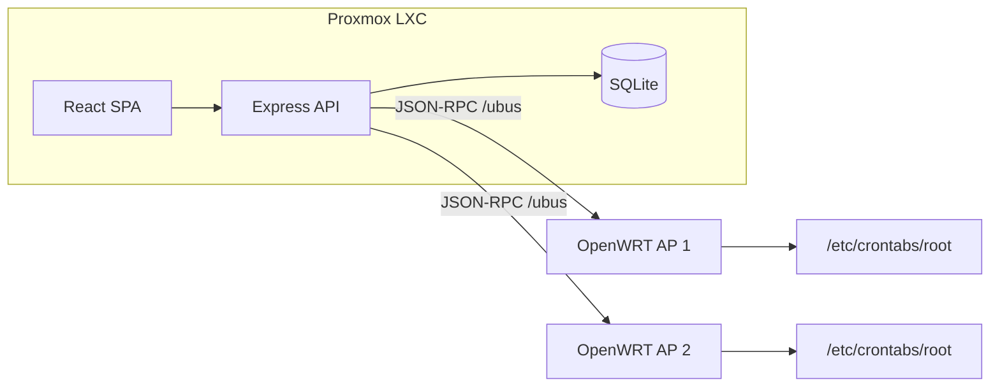

<!-- 2064d804-8993-44cc-a80a-397a892e0345 -->
---
todos:
  - id: "scaffold"
    content: "Scaffold wifi-control monorepo (Express + React + Prisma) mirroring timer-app structure"
    status: pending
  - id: "openwrt-setup"
    content: "Create rpcd ACL, uhttpd-mod-ubus config, and bootstrap script for each AP"
    status: pending
  - id: "ubus-service"
    content: "Implement ubus JSON-RPC client (session login, uci get/set/commit, file crontab R/W, wifi reload)"
    status: pending
  - id: "api-routes"
    content: "Build auth, networks (toggle/status), schedules, and access-points API routes"
    status: pending
  - id: "frontend-ui"
    content: "Build PIN gate, SSID dashboard with toggles, and per-SSID schedule editor"
    status: pending
  - id: "admin-setup"
    content: "Add admin UI to register APs and map UCI wifi-iface sections to labels"
    status: pending
  - id: "deploy"
    content: "Create install.sh, deploy.sh, systemd unit, and Proxmox deployment README"
    status: pending
isProject: false
---
# OpenWRT WiFi Control App

## Goal

A single-page web app + Node backend that lets you quickly turn individual WiFi SSIDs on/off across multiple OpenWRT APs, and configure a separate on/off schedule (cron) for each SSID. Hosted on a Proxmox LXC container using the same deployment pattern as [`timer-app`](file:///home/debugthings/repos/timer-app).

## Architecture



**Why ubus JSON-RPC (via `uhttpd-mod-ubus`) instead of SSH:**
- Native OpenWRT API — structured requests/responses, no shell parsing
- Scoped rpcd ACL limits each AP user to only wireless UCI + crontab file access
- No SSH key lifecycle; per-AP credentials stored encrypted in SQLite
- LXC initiates outbound HTTP to AP LAN IPs — uhttpd stays LAN-only, never internet-exposed
- PIN auth still handled centrally by our Express service (SPA never talks to APs directly)

## Tech Stack (mirror timer-app)

| Layer | Choice |
|---|---|
| Frontend | React 18, TypeScript, Vite, TailwindCSS, React Query |
| Backend | Node 20, Express, TypeScript |
| Persistence | SQLite via Prisma (PIN hash, AP definitions, per-SSID schedules) |
| Remote control | ubus JSON-RPC over HTTP (`uhttpd-mod-ubus` on each AP) |
| Deployment | systemd service, `install.sh` / `deploy.sh` / `update.sh` |

Reuse patterns directly from timer-app:
- PIN flow: [`backend/src/routes/admin.ts`](file:///home/debugthings/repos/timer-app/backend/src/routes/admin.ts) + [`backend/src/middleware/adminAuth.ts`](file:///home/debugthings/repos/timer-app/backend/src/middleware/adminAuth.ts) (`bcrypt` hash, `x-admin-pin` header on mutating routes)
- Single-service SPA hosting: [`backend/src/index.ts`](file:///home/debugthings/repos/timer-app/backend/src/index.ts)

## New Project Layout

Create `wifi-control/` (sibling to timer-app, or under `/home/debugthings/repos/wifi-control`):

```
wifi-control/
├── backend/
│   ├── src/
│   │   ├── index.ts
│   │   ├── routes/auth.ts          # PIN verify/set (timer-app pattern)
│   │   ├── routes/networks.ts      # SSID status + toggle
│   │   ├── routes/schedules.ts     # per-SSID cron CRUD
│   │   ├── routes/accessPoints.ts  # AP health + discovery
│   │   ├── services/ubusClient.ts  # JSON-RPC session + call wrapper
│   │   ├── services/openwrt.ts     # uci get/set/commit + wifi reload via ubus
│   │   ├── services/cronManager.ts # tagged crontab read/write via ubus file
│   │   └── middleware/pinAuth.ts
│   └── prisma/schema.prisma
├── frontend/
│   └── src/
│       ├── pages/Dashboard.tsx     # SSID toggle grid
│       ├── pages/ScheduleEditor.tsx
│       ├── components/PinGate.tsx
│       └── services/api.ts
├── openwrt/
│   ├── acl.d/wifi-control.json     # rpcd ACL (wireless uci + crontab only)
│   └── scripts/bootstrap-ap.sh     # install packages, create rpcd user, deploy ACL
├── install.sh                      # Proxmox LXC installer (timer-app style)
├── deploy.sh / update.sh
└── README.md
```

## Data Model (Prisma)

```prisma
model Settings {
  id           Int     @id @default(1)
  adminPinHash String?
}

model AccessPoint {
  id           String   @id          // e.g. "garage-ap"
  name         String                 // display name
  host         String                 // LAN IP or hostname
  ubusUrl      String   @default("/ubus")  // uhttpd ubus endpoint path
  ubusUsername String                 // rpcd user (e.g. "wifi-control")
  ubusPassword String                 // stored encrypted at rest (AES-256-GCM)
  useHttps     Boolean  @default(false)   // true if uhttpd serves TLS on LAN
  enabled      Boolean  @default(true)
  networks     Network[]
}

model Network {
  id            String      @id   // e.g. "garage-kids-5g"
  accessPointId String
  accessPoint   AccessPoint @relation(...)
  label         String            // "Kids 5GHz"
  uciSection    String            // "wifinet1" (named wifi-iface section)
  enabled       Boolean  @default(true)
  schedule      Schedule?
}

model Schedule {
  id        Int     @id @default(autoincrement())
  networkId String  @unique
  network   Network @relation(...)
  enabled   Boolean @default(false)
  offTime   String  // "22:00" (24h, local TZ)
  onTime    String  // "07:00"
  days      String  // JSON: ["mon","tue",...]
}
```

AP/network definitions are seeded via admin API or a one-time setup wizard (not hardcoded). AP ubus passwords are encrypted with a server-side key from `.env` (`ENCRYPTION_KEY=...`).

## OpenWRT Side (per AP)

### 1. Required packages

Install on each AP via LuCI or opkg:
```sh
opkg update
opkg install uhttpd-mod-ubus rpcd rpcd-mod-file rpcd-mod-uci
/etc/init.d/rpcd restart
/etc/init.d/uhttpd restart
```

Ensure uhttpd listens on LAN only (default). The `/ubus` endpoint is provided automatically by `uhttpd-mod-ubus`.

### 2. Bootstrap script (`openwrt/scripts/bootstrap-ap.sh`)

Run once per AP (via existing LuCI SSH or serial) to:
1. Install required opkg packages (above)
2. Deploy rpcd ACL file to `/usr/share/rpcd/acl.d/wifi-control.json`
3. Create rpcd user `wifi-control` with a generated password
4. Copy a small `/usr/local/bin/wifi-iface-toggle` helper script (used by cron only — keeps cron lines simple)
5. Restart `rpcd` and verify ubus login works

### 3. rpcd ACL (`openwrt/acl.d/wifi-control.json`)

Scoped permissions — no root, no full UCI access:

```json
{
  "wifi-control": {
    "description": "WiFi control app — wireless UCI + crontab only",
    "read": {
      "uci": ["wireless"],
      "file": {
        "/etc/crontabs/root": ["read"]
      }
    },
    "write": {
      "uci": ["wireless"],
      "file": {
        "/etc/crontabs/root": ["write"]
      },
      "ubus": {
        "rc": ["*"],
        "service": ["*"]
      }
    }
  }
}
```

Tighten further in v2 if needed; this is already far less than root SSH.

### 4. ubus JSON-RPC calls (backend uses these)

**Login** (get session token):
```json
POST http://<ap-ip>/ubus
{"jsonrpc":"2.0","id":1,"method":"call","params":["00000000000000000000000000000000","session","login",{"username":"wifi-control","password":"<pass>"}]}
→ returns ubus_rpc_session token
```

**Get SSID disabled state:**
```json
{"method":"call","params":["<token>","uci","get",{"config":"wireless","section":"wifinet0"}]}
```

**Disable SSID:**
```json
{"method":"call","params":["<token>","uci","set",{"config":"wireless","section":"wifinet0","values":{"disabled":"1"}}]}
{"method":"call","params":["<token>","uci","commit",{"config":"wireless"}]}
{"method":"call","params":["<token>","rc","reload",{"name":"network"}]}
```
After commit, reload the specific radio: read `device` from the iface section, then call `wifi reload <radio>` via a whitelisted helper script. If per-radio reload isn't available via ubus alone, the bootstrap script installs `/usr/local/bin/wifi-iface-toggle` and cron uses that path directly.

**Discover wifi-iface sections:**
```json
{"method":"call","params":["<token>","uci","get",{"config":"wireless"}]}
```
Parse response for sections where `.type == "wifi-iface"`.

### 5. Cron helper script (AP-local, cron-only)

```sh
# /usr/local/bin/wifi-iface-toggle <uci-section> <on|off>
# Uses uci directly (runs as root via cron, not via ubus)
```
Cron lines stay tagged; the backend writes them via ubus `file` write to `/etc/crontabs/root`, then calls `rc restart cron`.

Admin setup: use the **Discover SSIDs** button in the admin UI (ubus `uci get wireless`) to map friendly labels to section names (e.g. `wifinet0` → "Guest 2.4G").

## Backend API

| Method | Endpoint | Auth | Purpose |
|---|---|---|---|
| GET | `/api/auth/settings` | none | PIN configured? |
| POST | `/api/auth/verify-pin` | none | Validate PIN |
| POST | `/api/auth/set-pin` | none/first-run | Set PIN |
| GET | `/api/networks` | none | All SSIDs + live disabled state (ubus) |
| POST | `/api/networks/:id/toggle` | PIN | Enable/disable one SSID via ubus uci |
| GET | `/api/networks/:id/schedule` | PIN | Read schedule from DB + verify cron on AP |
| PUT | `/api/networks/:id/schedule` | PIN | Save schedule + rewrite AP crontab via ubus file |
| POST | `/api/access-points/:id/test` | PIN | ubus login + uci get connectivity check |
| POST | `/api/access-points/:id/discover` | PIN | List wifi-iface sections from AP via ubus |
| POST | `/api/access-points` | PIN | Add AP |
| POST | `/api/networks` | PIN | Add SSID mapping |

**Status fetch:** parallel ubus calls to all APs (one session login per AP per request, cached for request duration only).

**Toggle flow:**
1. Validate PIN
2. ubus `uci set` → `uci commit` → reload wireless
3. Return updated `disabled` state via ubus `uci get`

## Cron Management (per SSID)

Each schedule writes **tagged** crontab lines on the AP so we never clobber unrelated jobs:

```
0 22 * * * /usr/local/bin/wifi-iface-toggle wifinet1 off # wifi-control:wifinet1-off
0 7 * * * /usr/local/bin/wifi-iface-toggle wifinet1 on  # wifi-control:wifinet1-on
```

[`cronManager.ts`](wifi-control/backend/src/services/cronManager.ts) will:
1. Read `/etc/crontabs/root` via ubus `file read`
2. Strip lines matching `# wifi-control:<section>-off|on`
3. Insert new lines if schedule enabled
4. Write back via ubus `file write` and call ubus `rc restart {"name":"cron"}`

Day-of-week filtering uses standard cron DOW fields derived from the `days` JSON array. Timezone: store schedules in local time; document that AP system clock must be correct (OpenWRT `system.ntp` enabled).

## Frontend UX

Mobile-first, minimal taps:

1. **PIN gate** on first visit (reuse timer-app PinGate component pattern)
2. **Dashboard** — grouped by AP, one card per SSID:
   - Label + band hint (parsed from UCI if available)
   - Large on/off toggle (optimistic UI, revert on ubus failure)
   - Green/red status dot for AP reachability
3. **Schedule drawer/modal** per SSID:
   - Enable/disable schedule toggle
   - Off time / On time pickers
   - Day-of-week checkboxes
   - "Apply" pushes cron to AP
4. **Admin section** (PIN required):
   - Add AP (host, ubus username/password)
   - Discover SSIDs button (lists wifi-iface sections from AP)
   - Add SSID (pick AP, select UCI section, set label)
   - Test ubus connection button

No login sessions beyond storing verified PIN in `sessionStorage` (same lightweight approach as timer-app header).

## ubus Setup (included in deployment docs)

Documented in README + bootstrap script:

1. On each AP: run `bootstrap-ap.sh` (installs packages, deploys ACL, creates `wifi-control` rpcd user)
2. In admin UI: add AP with host + ubus credentials generated by bootstrap
3. Ensure LXC can reach AP management IPs on port 80/443 (same LAN/VLAN)
4. Firewall: uhttpd stays LAN-bound; our LXC initiates outbound HTTP only — never expose `/ubus` to WAN
5. Generate `ENCRYPTION_KEY` on LXC during install to encrypt AP passwords at rest in SQLite

## Deployment (Proxmox LXC)

Clone timer-app deployment verbatim with renamed paths:

- Service: `wifi-control.service` running `/usr/bin/node dist/index.js`
- Port: `3002` (avoid collision with timer-app on `3001`)
- Data: `/opt/wifi-control/data/wifi-control.db`
- Secrets: `ENCRYPTION_KEY` in `/opt/wifi-control/.env` (encrypts AP ubus passwords in DB)
- Optional NGINX reverse proxy to `wifi.debugthings.com` using your existing [`debugthings.com`](file:///home/debugthings/azure.ini) DNS zone

Files to create:
- `install.sh` — Node 20, clone, build, systemd, generate `ENCRYPTION_KEY`
- `deploy.sh` / `update.sh` — same auto-update gate pattern as timer-app

## Security Notes ( proportionate to "simple PIN" )

- PIN hashed with bcrypt; sent only over HTTPS if behind reverse proxy (document this)
- AP ubus passwords encrypted at rest (AES-256-GCM); decrypted only in memory per request
- rpcd ACL scopes each AP user to wireless UCI + crontab file only (no root)
- `.env` and encryption key in `.gitignore`
- Rate-limit PIN attempts (simple in-memory counter, 5 failures / 15 min)
- No router credentials stored beyond scoped rpcd user passwords (encrypted at rest)

## Implementation Order

1. Scaffold monorepo + Prisma schema + Express skeleton (timer-app clone)
2. ubus JSON-RPC client + rpcd ACL + bootstrap script
3. Networks API (status + toggle via ubus uci)
4. Cron manager (ubus file read/write) + schedules API
5. React dashboard + schedule UI + PIN gate
6. Admin CRUD for APs/networks + SSID discovery
7. Proxmox install/deploy scripts + README
8. Manual test against one real AP, then add second AP

## Out of Scope (v1)

- Per-SSID control at the `wifi-device` (whole radio) level — you chose wifi-iface only
- LuCI UI integration (we use ubus directly, not LuCI)
- Exposing `/ubus` to the internet (LAN-only always)
- Push notifications / webhooks
- Multi-user accounts or OAuth

## Test Plan

- Unit tests: cron line parsing/generation, schedule-to-cron conversion
- Integration tests: mock ubus JSON-RPC layer for toggle + crontab rewrite
- Manual: bootstrap one AP, toggle SSID from phone browser, verify LuCI shows disabled state, verify cron fires at scheduled time
