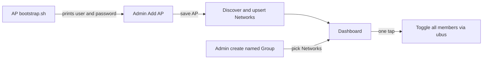

<!-- 2064d804-8993-44cc-a80a-397a892e0345 -->
---
todos:
  - id: "schema-groups"
    content: "Add NetworkGroup + NetworkGroupMember Prisma models and migrate"
    status: pending
  - id: "sync-service"
    content: "Implement syncNetworksFromAp; wire into AP create + discover"
    status: pending
  - id: "groups-api"
    content: "Add /api/groups CRUD + toggle with aggregate status"
    status: pending
  - id: "admin-ui"
    content: "Simplify AP setup for bootstrap paste; auto-list SSIDs; group editor"
    status: pending
  - id: "dashboard-ui"
    content: "Dashboard group toggles above individual network cards"
    status: pending
  - id: "tests"
    content: "Tests for iface filter/upsert and group toggle settlement"
    status: pending
isProject: false
---
# Auto-discover SSIDs and named groups

## Current state

- OpenWrt bootstrap already prints `wifi-control` + password ([openwrt/install.sh](repos/wifi-control/openwrt/install.sh)).
- Backend can discover ifaces via `discoverWifiIfaces` and `POST /api/access-points/:id/discover` ([backend/src/services/openwrt.ts](repos/wifi-control/backend/src/services/openwrt.ts), [backend/src/routes/accessPoints.ts](repos/wifi-control/backend/src/routes/accessPoints.ts)), but **does not create** `Network` rows.
- Admin UI requires manual “Add network” after Discover ([frontend/src/pages/AdminPage.tsx](repos/wifi-control/frontend/src/pages/AdminPage.tsx)).
- Dashboard lists per-network cards grouped by AP only ([frontend/src/pages/Dashboard.tsx](repos/wifi-control/frontend/src/pages/Dashboard.tsx)).

## Target UX



1. On AP: run bootstrap → copy username/password.
2. In app Admin: enter name, host, username, password → Save.
3. App tests connection, discovers `wifi-iface` sections, **auto-creates** `Network` rows (label/ssid from UCI; skip non-AP modes like `sta`/`mesh`).
4. In Admin: create a named group (e.g. “Kids WiFi”) and assign the four networks (NETGEAR13 + NETGEAR13-5G on each AP). Optional: “Suggest by SSID” multi-select helper.
5. Dashboard: **Groups** section with one ON/OFF button per group; keep individual network cards (collapsible or secondary) for fine control. Schedules stay per-network for this iteration.

## Data model

Add to [backend/prisma/schema.prisma](repos/wifi-control/backend/prisma/schema.prisma):

```prisma
model NetworkGroup {
  id        String   @id
  name      String
  createdAt DateTime @default(now())
  updatedAt DateTime @updatedAt
  members   NetworkGroupMember[]
}

model NetworkGroupMember {
  groupId   String
  networkId String
  group     NetworkGroup @relation(...)
  network   Network     @relation(...)
  @@id([groupId, networkId])
}
```

`Network` gains `groupMembers NetworkGroupMember[]`. Unique membership; deleting a network cascades membership. Deleting an AP already cascades networks → members drop.

## Backend

**Sync service** (new helper used by create + discover), e.g. `syncNetworksFromAp(ap)`:

- Call `discoverWifiIfaces`.
- Keep ifaces where `mode` is missing/`ap`/`ap-wpa*` (exclude `sta`, `mesh`, `adhoc`, `monitor`).
- Upsert by `(accessPointId, uciSection)`:
  - create: `id = ${apId}-${section}`, `label = ssid || section`, `ssid`
  - update: refresh `ssid`; update `label` only if it still equals the previous `ssid` or section (preserve custom labels)
- Do not prune missing sections by default (avoids wiping schedules); return `{ added, updated, ifaces }`.

**AP routes** ([accessPoints.ts](repos/wifi-control/backend/src/routes/accessPoints.ts)):

- `POST /` — after create, run sync; return AP + sync summary (or 201 + sync errors as warning field if ubus fails so AP still saves).
- `POST /:id/discover` — sync by default (`sync: true`); return ifaces + sync counts.
- Auto-generate `id` from slugified `name` if client omits `id`.

**Group routes** (new `routes/groups.ts`):

- `GET /api/groups` — groups with members + live aggregate status (`allOn` / `allOff` / `mixed` / `unreachable`).
- `POST /api/groups` — `{ id?, name, networkIds[] }`
- `PUT /api/groups/:id` — rename / replace members
- `DELETE /api/groups/:id`
- `POST /api/groups/:id/toggle` — `{ enabled: boolean }`; toggle each member via existing `setIfaceEnabled` (Promise.allSettled); return per-member results.

Wire in [index.ts](repos/wifi-control/backend/src/index.ts).

## Frontend

**Admin setup** ([AdminPage.tsx](repos/wifi-control/frontend/src/pages/AdminPage.tsx)):

- Simplify Add AP: name, host, username (default `wifi-control`), password; hide manual id (or optional advanced).
- On success: show “Discovered N SSIDs” and list them; remove required manual network form (keep optional advanced add/delete).
- “Rediscover” button = sync again.
- New **Groups** section: create group name, multi-select networks (show `label @ AP`), edit/delete; “Select all matching SSID …” helper chips from unique ssid values.

**Dashboard** ([Dashboard.tsx](repos/wifi-control/frontend/src/pages/Dashboard.tsx)):

- Top: Group cards with single large ON/OFF (same visual language as today’s network toggle).
- Below: existing per-AP network list (or under an “Individual SSIDs” heading).

**API client** ([api.ts](repos/wifi-control/frontend/src/services/api.ts) + types): add group CRUD/toggle; extend create AP response typing for sync summary.

## Out of scope (this pass)

- Group-level schedules (still per-network).
- Scanning the LAN for APs (still paste host + bootstrap credentials).
- Changing OpenWrt bootstrap output format (already sufficient).

## Verify

- Unit-test sync filtering (sta skipped, ap upserted) and group toggle aggregating settled results.
- Manual: add AP with mock/lab ubus → networks appear; create group of 4 → one toggle flips all.